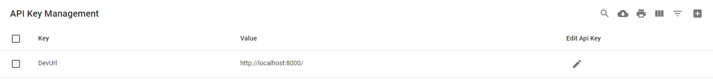

# pebble
An FastApi web server project that demonstrates and processes OSINT LIAR backend requests. This system
is intended to be a template and overtime collect additional features needed for individual developers or teams
that are interested in adding their tools into the OSINT LIAR ecosystem. 


## Discovery Plugins
The discovery plugins has example plugins that can be imported into your OSINT LIAR
installation. You can then configure the plugins to your needs

You will need to set up an Api Key that points to the IP and port of this software
running. Specifically, the `DevUrl` needs to be set to something like http://localhost:8000/




## Docker Setup

```shell
docker-compose build
docker-compose up
```

## Command line setup

```shell
pip install poetry
poetry shell
poetry install
poetry run uvicorn pebble.main:app --host 0.0.0.0 --port 8000 --reload
```


